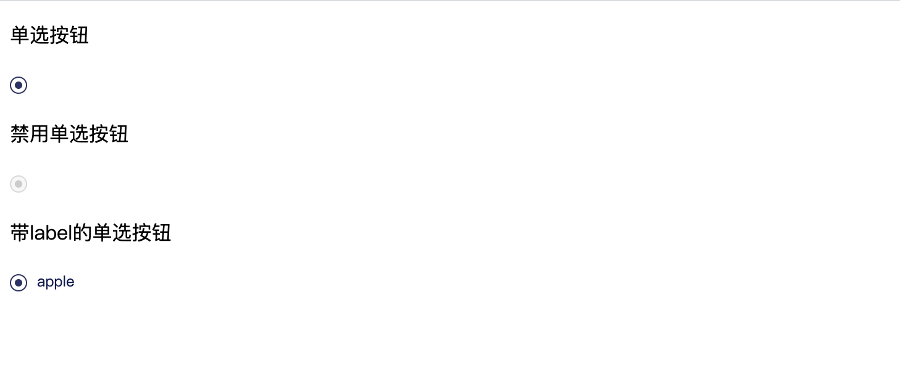

## react-beautiful-radio

* Created By ancf - (博客地址)[https://kafeihaoka.github.io/myBlog.html#/welcome]

* react-beautiful-radio 为一款基于react实现的radio组件。



DEMO示例地址：https://kafeihaoka.github.io/react-beautiful-radio/

## 安装依赖
npm i react-beautiful-radio -S

## API 介绍

| Property | Description | Type | Default |
| --- | --- | --- | --- |
| checked | 是否选中 | bool | false |
| disabled | 是否禁用 | bool | false |
| value | 描述文本 | string | - |
| onClick | 点击事件 | function(e){} | - |

## 用法示例

```

import BeautyRadio from "react-beautiful-radio";

class RadioDemo extends React.Component {
      state = {
        checked : true
      };

    handleChange = () => {
        this.setState({
            checked: !this.state.checked
        })
    }

  render() {
    const { checked } = this.state;
    return (
      <div>
        <BeautyRadio
          checked={checked}
          value={'apple'}
          onClick={this.handleChange}
        />
      </div>
    );
  }
}

ReactDOM.render(<RadioDemo />, mountNode);

```

## 相关资料

- react  component  radio  react-beautiful-radio

